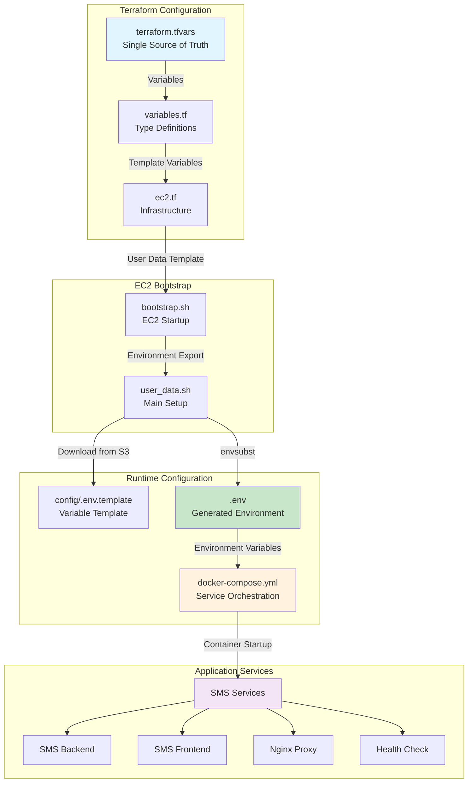

# SMS Seller Connect Variable Flow Documentation

## Overview

This document explains how variables flow through the SMS Seller Connect infrastructure, from Terraform configuration to Docker containers. The architecture ensures a single source of truth for all configuration while maintaining security and consistency.

## Architecture Diagram



## Variable Flow Process

### 1. Configuration Source (`terraform.tfvars`)
**Purpose**: Single source of truth for all variables
**Location**: `Infrastructure/sms-seller-connect/modules/ec2/terraform.tfvars`

```hcl
# Docker Images
backend_image  = "522814698925.dkr.ecr.us-east-1.amazonaws.com/sms-wholesaling-backend:latest"
frontend_image = "522814698925.dkr.ecr.us-east-1.amazonaws.com/sms-wholesaling-frontend:latest"

# Database Configuration
db_host     = "ec2-54-237-212-127.compute-1.amazonaws.com"
db_port     = "5437"
db_name     = "sms_blast"
db_user     = "smsblastadmin"
db_password = "ChangeMe123!"

# Domain Configuration
sms_frontend_domain = "sms.typerelations.com"
sms_api_domain      = "api.sms.typerelations.com"
```

### 2. Type Definitions (`variables.tf`)
**Purpose**: Define variable types and validation
**Location**: `Infrastructure/sms-seller-connect/modules/ec2/variables.tf`

```hcl
variable "backend_image" {
  description = "Docker image for SMS backend (ECR repository URL with tag)"
  type        = string
}

variable "frontend_image" {
  description = "Docker image for SMS frontend (ECR repository URL with tag)"
  type        = string
}
```

### 3. Infrastructure Template (`ec2.tf`)
**Purpose**: Pass variables to EC2 user data
**Location**: `Infrastructure/sms-seller-connect/modules/ec2/ec2.tf`

```hcl
user_data = base64encode(templatefile("${path.module}/scripts/bootstrap.sh", {
  # Docker Images
  BACKEND_IMAGE       = var.backend_image
  FRONTEND_IMAGE      = var.frontend_image
  
  # Domain Configuration
  SMS_API_DOMAIN      = var.sms_api_domain
  SMS_FRONTEND_DOMAIN = var.sms_frontend_domain
  
  # Database configuration
  DB_HOST             = var.db_host
  DB_PORT             = var.db_port
  # ... other variables
}))
```

### 4. EC2 Bootstrap (`bootstrap.sh`)
**Purpose**: Initial EC2 setup and variable export
**Location**: `Infrastructure/sms-seller-connect/modules/ec2/scripts/bootstrap.sh`

```bash
# Export all environment variables for the user_data script
export BACKEND_IMAGE="$BACKEND_IMAGE"
export FRONTEND_IMAGE="$FRONTEND_IMAGE"
export SMS_API_DOMAIN="$SMS_API_DOMAIN"
export SMS_FRONTEND_DOMAIN="$SMS_FRONTEND_DOMAIN"
export DB_HOST="$DB_HOST"
export DB_PORT="$DB_PORT"
# ... other exports

# Execute the main user_data script
bash "$SCRIPT_PATH"
```

### 5. Main Setup Script (`user_data.sh`)
**Purpose**: Download configuration and create environment file
**Location**: `Infrastructure/sms-seller-connect/modules/ec2/scripts/user_data.sh`

```bash
# Export environment variables for envsubst
export BACKEND_IMAGE="${BACKEND_IMAGE}"
export FRONTEND_IMAGE="${FRONTEND_IMAGE}"
export SMS_API_DOMAIN="${SMS_API_DOMAIN}"
export SMS_FRONTEND_DOMAIN="${SMS_FRONTEND_DOMAIN}"
# ... other exports

# Create environment file from template with actual values
envsubst < .env.template > .env
```

### 6. Environment Template (`.env.template`)
**Purpose**: Template for environment variables
**Location**: `Infrastructure/sms-seller-connect/modules/ec2/config/.env.template`

```bash
# ECR Images
BACKEND_IMAGE=${BACKEND_IMAGE}
FRONTEND_IMAGE=${FRONTEND_IMAGE}

# Domain Configuration
SMS_API_DOMAIN=${SMS_API_DOMAIN}
SMS_FRONTEND_DOMAIN=${SMS_FRONTEND_DOMAIN}

# Database Configuration
DB_HOST=${DB_HOST}
DB_PORT=${DB_PORT}
DATABASE_URL=postgresql://${DB_USER}:${DB_PASSWORD}@${DB_HOST}:${DB_PORT}/${DB_NAME}
```

### 7. Generated Environment File (`.env`)
**Purpose**: Runtime environment variables for Docker Compose
**Location**: `/app/sms-seller-connect/.env` (on EC2 instance)

```bash
# Generated by envsubst from .env.template
BACKEND_IMAGE=522814698925.dkr.ecr.us-east-1.amazonaws.com/sms-wholesaling-backend:latest
FRONTEND_IMAGE=522814698925.dkr.ecr.us-east-1.amazonaws.com/sms-wholesaling-frontend:latest
SMS_API_DOMAIN=api.sms.typerelations.com
SMS_FRONTEND_DOMAIN=sms.typerelations.com
DB_HOST=ec2-54-237-212-127.compute-1.amazonaws.com
```

### 8. Docker Compose Configuration (`docker-compose.yml`)
**Purpose**: Service orchestration using environment variables
**Location**: `Infrastructure/sms-seller-connect/modules/ec2/config/docker-compose.yml`

```yaml
services:
  sms_backend:
    image: ${BACKEND_IMAGE}
    environment:
      - DB_HOST=${DB_HOST}
      - DB_PORT=${DB_PORT}
      - TWILIO_WEBHOOK_URL=https://${SMS_API_DOMAIN}/api/webhooks/sms
      
  sms_frontend:
    image: ${FRONTEND_IMAGE}
    environment:
      - VITE_API_URL=https://${SMS_API_DOMAIN}
      - REACT_APP_API_URL=https://${SMS_API_DOMAIN}
```

## Key Benefits

### ✅ Single Source of Truth
- All variables defined once in `terraform.tfvars`
- No duplicate configuration files to maintain
- Consistent values across infrastructure and application

### ✅ Type Safety & Validation
- Variables validated through Terraform type system
- Required variables enforced at plan time
- Clear documentation of expected values

### ✅ Security
- Sensitive values handled through Terraform variables
- No hardcoded secrets in configuration files
- Environment file created with restricted permissions (chmod 600)

### ✅ Infrastructure as Code
- Everything managed through Terraform
- Version controlled configuration
- Reproducible deployments

### ✅ Flexibility
- Easy to add new variables
- Environment-specific configurations
- Support for multiple deployment environments

## Directory Structure

```
Infrastructure/sms-seller-connect/modules/ec2/
├── terraform.tfvars              # 📝 Variable definitions
├── variables.tf                  # 🔧 Type definitions
├── ec2.tf                       # 🏗️ Infrastructure template
├── config/                      # 📁 Configuration files
│   ├── docker-compose.yml       # 🐳 Service orchestration
│   ├── nginx.conf              # 🌐 Reverse proxy config
│   ├── .env.template           # 📋 Environment template
│   └── README.md               # 📖 Config documentation
└── scripts/                    # 📁 Bootstrap scripts
    ├── bootstrap.sh            # 🚀 Initial EC2 setup
    ├── user_data.sh           # ⚙️ Main configuration
    ├── maintenance.sh         # 🔧 Ongoing maintenance
    └── health-check.sh        # 💓 Health monitoring
```

## Deployment Process

1. **Developer Updates** `terraform.tfvars` with new values
2. **Terraform Plan** validates variables and shows changes
3. **Terraform Apply** uploads configuration files to S3
4. **EC2 Bootstrap** downloads and executes setup scripts
5. **Environment Generation** creates `.env` from template
6. **Docker Compose** starts services with generated environment
7. **Service Discovery** containers communicate using internal networking

## Troubleshooting

### Variable Not Appearing in Container
1. Check if variable is defined in `terraform.tfvars`
2. Verify variable is declared in `variables.tf`
3. Confirm variable is passed in `ec2.tf` user_data template
4. Check if variable is exported in `bootstrap.sh`
5. Verify variable is exported in `user_data.sh`
6. Confirm variable is in `.env.template`
7. Check generated `.env` file on EC2 instance

### Updating Variables
1. Modify `terraform.tfvars`
2. Run `terraform apply` to upload new configuration
3. Restart EC2 instance or manually run update scripts
4. Verify new values in generated `.env` file

## Security Considerations

- **Sensitive Variables**: Use Terraform sensitive variables for secrets
- **File Permissions**: `.env` file created with 600 permissions
- **S3 Security**: Configuration files stored in private S3 bucket
- **Network Security**: Variables transmitted over encrypted connections
- **Access Control**: EC2 instance uses IAM roles for S3 access

## Maintenance

- **Regular Updates**: Keep Docker images updated in `terraform.tfvars`
- **Security Patches**: Update AMI and base images regularly
- **Monitoring**: CloudWatch logs capture all variable processing
- **Backup**: Terraform state and configuration files are version controlled 
